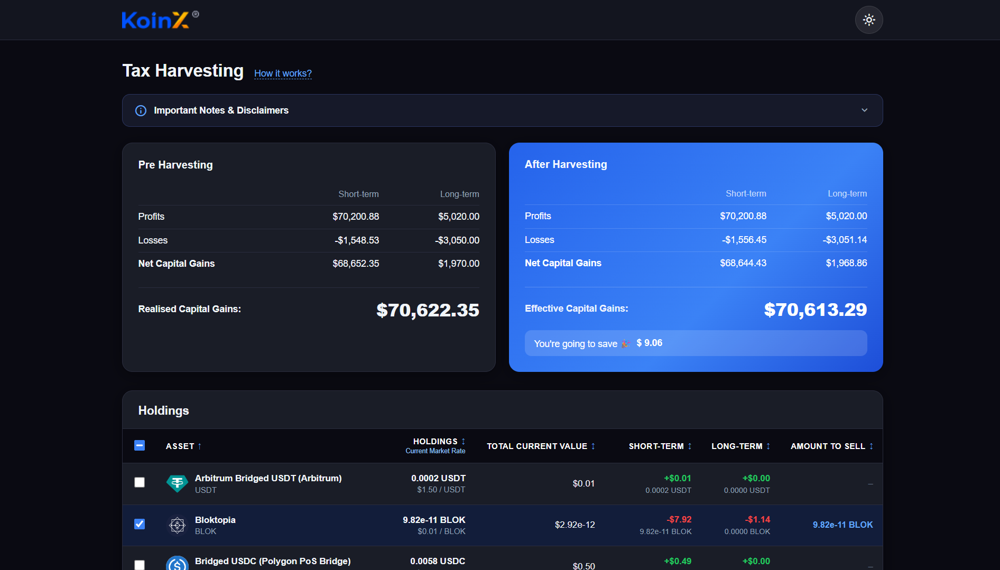
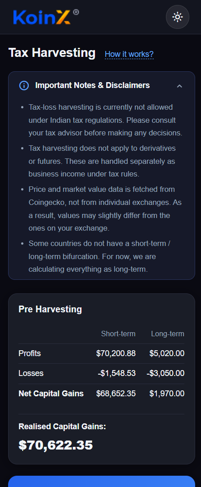

# KoinX Assignment

A React + Vite app for visualizing crypto holdings and simulating tax-loss harvesting outcomes.

## Live Demo

https://koin-x-assignment-red.vercel.app

## What It Does

This dashboard shows two capital gains summaries and a holdings table backed by mocked data.

- Compares pre-harvesting and after-harvesting capital gains for STCG and LTCG.
- Lets you select holdings to simulate what happens when those assets are harvested.
- Recalculates effective gains and estimated savings from the current selection.
- Supports sorting by clicking table headers.
- Shows only the top 5 holdings until you click `View all`.
- Includes a dark/light theme toggle.

## Tech Stack

- React 19
- Vite 8
- React Context for shared state
- ESLint 9

## Getting Started

Install dependencies:

```bash
npm install
```

Start the development server:

```bash
npm run dev
```

Open the local URL shown in the terminal, usually `http://localhost:5173`.

## Scripts

- `npm run dev`: start the Vite dev server
- `npm run build`: build the app for production
- `npm run preview`: preview the production build locally
- `npm run lint`: run ESLint checks

## Project Structure

```text
src/
  App.jsx
  App.css
  main.jsx
  components/
    CapitalGainsCards.jsx
    Disclaimer.jsx
    HoldingsTable.jsx
    Navbar.jsx
  context/
    AppContext.jsx
  data/
    mockApi.js
  assets/
    logo.png
```

## Calculation Flow

- Capital gains data is loaded from `src/data/mockApi.js`.
- Selecting a holding adds that holding's STCG and LTCG values to the after-harvesting totals.
- Positive gains contribute to profits.
- Negative gains contribute to losses.
- Savings are derived from the difference between pre-harvesting and after-harvesting realised gains.

## Screenshots

Place the exported images in `src/screenshots/` using the filenames below.

### Home






Suggested filenames:

- `src/screenshots/home-light.png`
- `src/screenshots/home-dark.png`
- `src/screenshots/holdings-sorted.png`
- `src/screenshots/holdings-expanded.png`

## Assumptions

- The app uses mocked API responses from `src/data/mockApi.js`.
- Currency values are displayed in dollars throughout the interface.
- After-harvesting values are calculated from the currently selected holdings.
- The top 5 holdings are shown by default until `View all` is clicked.
- Sorting applies to the currently visible dataset and can be expanded to all holdings.

## Notes

- The app uses mocked data and does not call a live API.
- It is intended for assignment/demo use, not tax advice.
